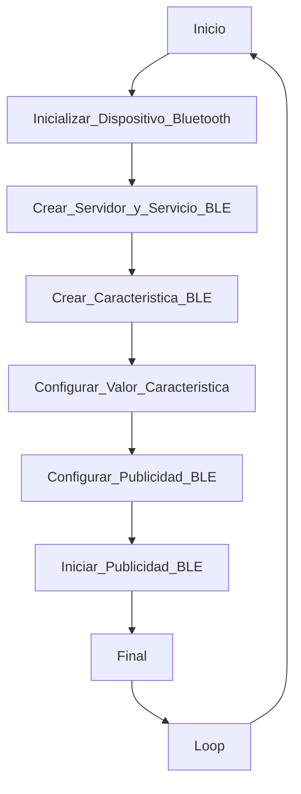

# PRACTICA 3 : BLUETOOTH 
Alumna: **Àfrica Abad**

## Objectivo
El objetivo de la practica es comprender el funcionamiento de WIFI Y BT.

Para lo cual realizaremos una practica  donde  generaremos un web server desde utilizando nuestra ESP32  y tambien  una comunicacion  serie con una aplicacion de un movil con BT .


## Practica B  comunicación bluetooth con el movil 

El código de la practica es el siguiente


```cpp
  #include "BluetoothSerial.h"

  #if !defined(CONFIG_BT_ENABLED) || !defined(CONFIG_BLUEDROID_ENABLED)
  #error Bluetooth is not enabled! Please run `make menuconfig` to and enable it
  #endif

  BluetoothSerial SerialBT;

  void setup() {
    Serial.begin(115200);
    SerialBT.begin("ESP32test"); //Bluetooth device name
    Serial.println("The device started, now you can pair it with bluetooth!");
  }

  void loop() {
    if (Serial.available()) {
      SerialBT.write(Serial.read());
    }
    if (SerialBT.available()) {
      Serial.write(SerialBT.read());
    }
    delay(20);
  }
```

Utilizar  la siguiente aplicación para realizar la comunicación serie 


### informe
  realizar el informe de funcionamiento  asi como las salidas que se obtienen a través de la impresión serie 

El código que se nos proporciona establece una comunicación Bluetooth entre un dispositivo ESP32 y otro dispositivo Bluetooth (en nuestro caso utilizamos el teléfono para conectarnos a la placa).

Velocidad de la comunicación serie -> 115200 baudios.

Se inicia la comunicación Bluetooth con el nombre 'ESP32test'

Se imprime un mensaje en la consola serie que dice:

      "The device started, now you can pair it with bluetooth!"

Indicando que el dispositivo ha comenzado y está listo para emparejarse a través de Bluetooth.Llegados a este punto, nuestro dispositivo móvil detecta el chip 'ESP32test. Lo seleccionamos para emparejar ambos dispositivos.

Una vez ya tenemos la conexión establecida, usamos la aplicación 'Serial Bluetooth Terminal' para enviar y recibir datos desde la ESP32 (esto es lo que se mostraría por el puerto serie).


## Ejercicios de mejora de nota : Servidor ESP32 BLE

2. BLE ( bluetooth low energy) revisar e implementar el código del siguiente tutorial 
     https://randomnerdtutorials.com/esp32-bluetooth-low-energy-ble-arduino-ide/


¿Qué es Bluetooth de bajo consumo?

Bluetooth Bajo Consumo o "Low Energy", BLE para abreviar, es una variante de Bluetooth que ahorra energía. La aplicación principal de BLE es la transmisión a corta distancia de pequeñas cantidades de datos (bajo ancho de banda). A diferencia de Bluetooth, que siempre está activado, BLE permanece en modo de suspensión constantemente, excepto cuando se inicia una conexión.

Esto hace que consuma muy poca energía. BLE consume aproximadamente 100 veces menos energía que Bluetooth (según el caso de uso).

Además, BLE admite no solo la comunicación punto a punto, sino también el modo de transmisión y la red en malla.

Con Bluetooth Low Energy, existen dos tipos de dispositivos: el servidor y el cliente. El ESP32 puede actuar como cliente o como servidor.

El servidor anuncia su existencia, para que otros dispositivos puedan encontrarlo y contiene los datos que el cliente puede leer. 
El cliente escanea los dispositivos cercanos y, cuando encuentra el servidor que busca, establece una conexión y escucha los datos entrantes. A esto se le llama comunicación punto a punto.

  
  UUID

Cada servicio, característico y descriptor tiene un UUID (Universal Identifier Unico). Un UUID es un número único de 128 bits (16 bytes).


```cpp

#include <BLEDevice.h>
#include <BLEUtils.h>
#include <BLEServer.h>


#define SERVICE_UUID        "4fafc201-1fb5-459e-8fcc-c5c9c331914b"
#define CHARACTERISTIC_UUID "beb5483e-36e1-4688-b7f5-ea07361b26a8"

void setup() {
  Serial.begin(115200);
  Serial.println("Starting BLE work!");

  BLEDevice::init("AfricaBernat");
  BLEServer *pServer = BLEDevice::createServer();
  BLEService *pService = pServer->createService(SERVICE_UUID);
  BLECharacteristic *pCharacteristic = pService->createCharacteristic(
    CHARACTERISTIC_UUID,
    BLECharacteristic::PROPERTY_READ |
    BLECharacteristic::PROPERTY_WRITE
  );

  pCharacteristic->setValue("Hello World says Africa&Bernat");
  pService->start();
  // BLEAdvertising *pAdvertising = pServer->getAdvertising();  // this still is working for backward compatibility
  BLEAdvertising *pAdvertising = BLEDevice::getAdvertising();
  pAdvertising->addServiceUUID(SERVICE_UUID);
  pAdvertising->setScanResponse(true);
  pAdvertising->setMinPreferred(0x06);  // functions that help with iPhone connections issue
  pAdvertising->setMinPreferred(0x12);
  BLEDevice::startAdvertising();
  Serial.println("Characteristic defined! Now you can read it in your phone!");
}

void loop() {
  // put your main code here, to run repeatedly:
  delay(2000);
}
```

## Diagrama 




## Explicación de funcionamiento del código que porporcionamos

Creamos nuestro dispositivo BLE llamado 'AfricaBernat' ('BLEDevice::init("AfricaBernat");').

Configuramos el dispositivo BLE como servidor ('BLEServer *pServer = BLEDevice::createServer();').

En la expresión 'BLEService *pService = pServer->createService(SERVICE_UUID);'creamos un servicio para el servidor BLE con el UUID que ya hemos definido (UUID = "4fafc201-1fb5-459e-8fcc-c5c9c331914b").

Creamos una característica dentro del servidor con un UUID específico y propiedades de lectura y escritura.

Establecemos un valor para la característica:

    Hello World says Africa&Bernat.

En el bucle principal 'loop()' se inserta una pausa de dos segundos entre interacciones.

Durante la ejecución del código, se imprimen mensajes de depuración en el puerto serie. Los mensajes impresos incluyen información sobre el inicio del trabajo BLE y la definición de la característica, así como una indicación de que la característica está lista para ser leída desde un dispositivo móvil.

La salida de la impresión serie proporciona información sobre el estado y la configuración del dispositivo BLE. Los mensajes de depuración incluyen 
    
    Starting BLE work! 
    Characteristic defined! Now you can read it in your phone!

Una vez que el dispositivo ESP32 está en funcionamiento y anunciando su servicio BLE, otros dispositivos (por ejemplo: teléfonos móviles) pueden detectarlo y conectarse a él.

La característica definida en el servicio puede ser leída y escrita por otros dispositivos BLE conectados.


    