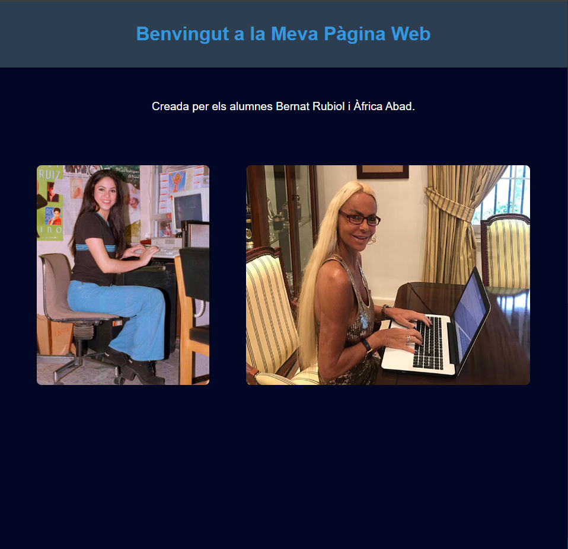
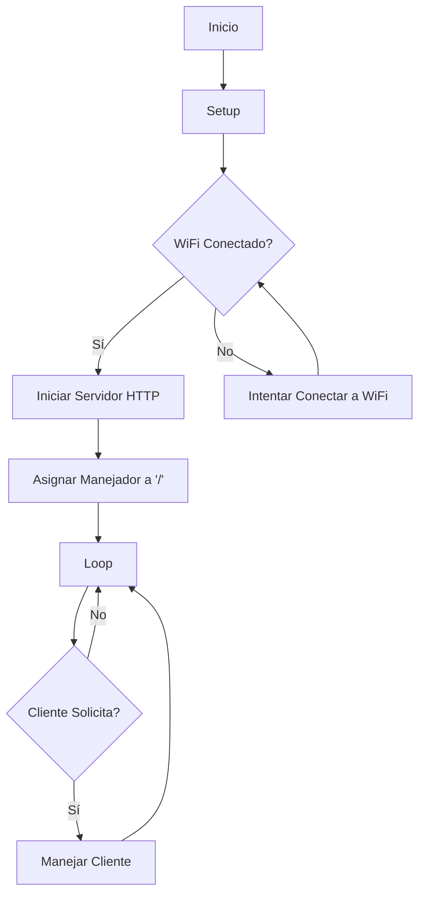

# PRACTICA 3 : WIFI  y BLUETOOTH 
# WIFI
Alumna: **Àfrica Abad**

## Objectivo
El objetivo de la practica es comprender el funcionamiento de WIFI Y BT.

Para lo cual realizaremos una practica  donde  generaremos un web server desde utilizando 
nuestra ESP32  y tambien  una comunicacion  serie con una aplicacion de un movil con BT .

## Practica A generación de una pagina web  
### Informe
  
  1. Realizar el informe de funcionamiento  asi como la salida por el terminal  y la  visualización de la conexión a la pagina web con un navegador
  2. Modificar la pagina web generando un fichero HTML con  el editor Mark down e incluirlo en el codigo . Incluir un fichero adicional que solo incluya la pagina html 
  
  Este apartado en clase no nos funcinó y mi compañero [Bernat](https://github.com/rubiolbernat) encontró el siguiente link: https://randomnerdtutorials.com/esp32-vs-code-platformio-spiffs/ donde se puede ver como leer un fichero txt, pero en vez de tener extensión  `.txt` lo hemos modificado para que sea `.html` para poderlo incoporar al código de la práctica.

  El código está completo en el apartado src.

  ``` cpp
  String readFile(String fileName) {
      File file = SPIFFS.open(fileName);
      String content = "";

      if (!file) {
          Serial.println("Failed to open file for reading");
          return content;
      }

      while (file.available()) {
          char c = file.read();
          content += c;
      }

      file.close();
      return content;
  }

  ```

  La función toma el nombre de un archivo como argumento, lo abre en formato lectura, lee su contenido, lo concatena en una cadena de caracteres y finalmente devuelve el contenido leído del archivo.
  Si no puede abrir el archivo correctamente, devuelve la cadena de caracteres vacía y emite un mensaje 'ERROR' poor el puerto serie.

  ```cpp
    void handle_root() {
        server.send(200, "text/html", fileContent);
    }

    void setup() {
        Serial.begin(115200);

        //Files setup
        if (!SPIFFS.begin(true)) {
            Serial.println("An Error has occurred while mounting SPIFFS");
            return;
        }

        fileContent = readFile("/index.html"); // Assigna el contingut a la variable global
        delay(1000);

        //Web setup
        Serial.println("Try Connecting to ");
        Serial.println(ssid);
        WiFi.begin(ssid, password);
        while (WiFi.status() != WL_CONNECTED) {
            delay(1000);
            Serial.print(".");
        }
        Serial.println("");
        Serial.println("WiFi connected successfully");
        Serial.print("Got IP: ");
        Serial.println(WiFi.localIP());  //Show ESP32 IP on serial

        server.begin();
        Serial.println("HTTP server started");
        
        server.on("/", handle_root);
    }
    
```

Esto establece una conexión WIFI, inicia un servidor .HTTP y configura una ruta ("/") para que cuando se reciba una solicitud GET en esa ruta, se responda con el contenido del archivo.


Una vez de introduce la IP que sale por el serial port, se puede ver la web creada.



## Diagrama de flujo


